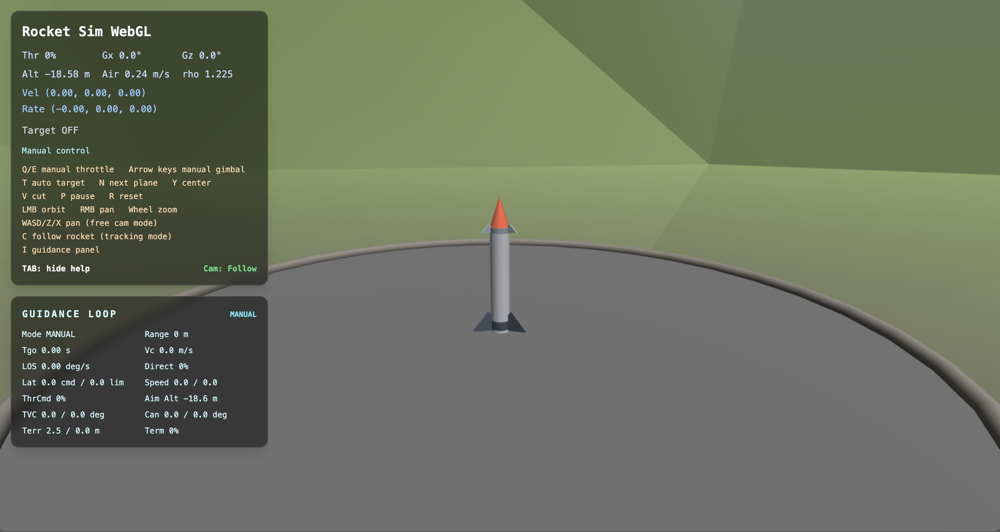
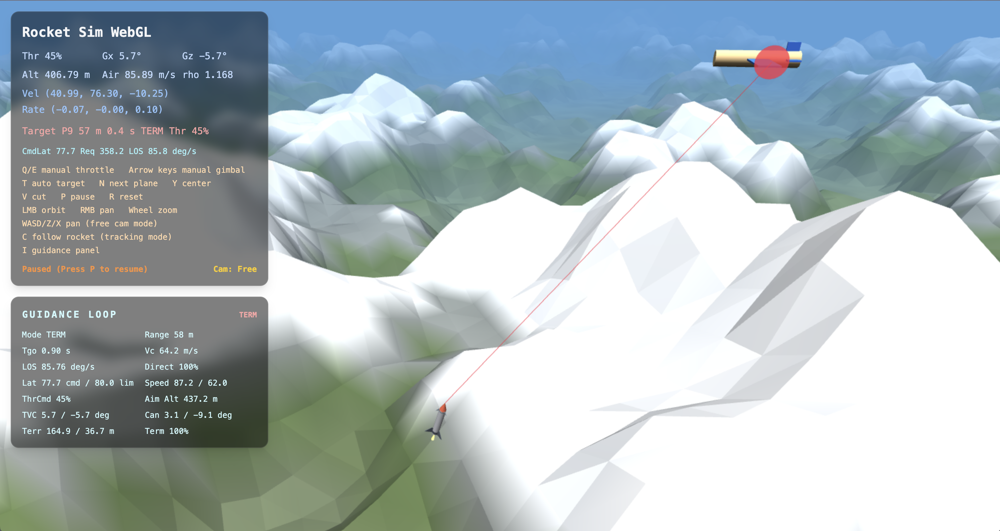
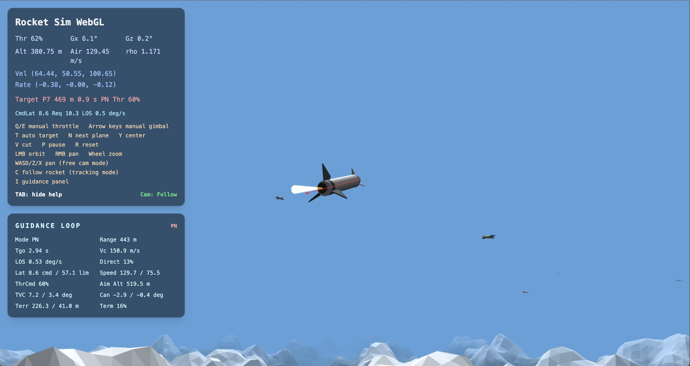

# RocketSim

Browser-based rocket point-fly intercept sim built with Three.js.

Launch a rocket from a pad, control thrust vectoring manually, or switch into auto-target mode to chase moving aircraft with a real guidance loop. The HUD exposes live guidance values instead of placeholder telemetry.

## Preview

## Controls

- `Q / E`: throttle up or down
- `Arrow keys`: manual gimbal
- `T`: toggle auto-target
- `N`: next target
- `Y`: recenter commands
- `V`: cut throttle
- `R`: reset
- `P`: pause
- `LMB / RMB / wheel`: orbit, pan, zoom
- `W A S D`: free-camera pan
- `X / Z`: camera up or down
- `C`: return to follow camera
- `I`: toggle guidance panel
- `Tab`: toggle help

## Guidance

The main guidance loop lives in `index.html`, primarily:

- `updateTargetPrediction()`
- `updateTargetingController()`
- `computeActuatorCommandsForDesiredAxis()`
- `stepPhysics()`

The sim runs at a fixed `240 Hz` step. Each step updates target aircraft, predicts intercept, builds a guidance acceleration command, converts it into TVC/canard commands, and applies forces and torques.

## Live Demo

[rocketsim.vidvuds.com](https://rocketsim.vidvuds.com/)
