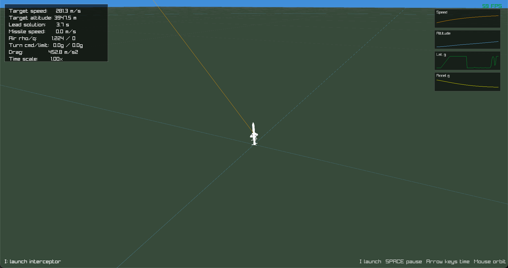
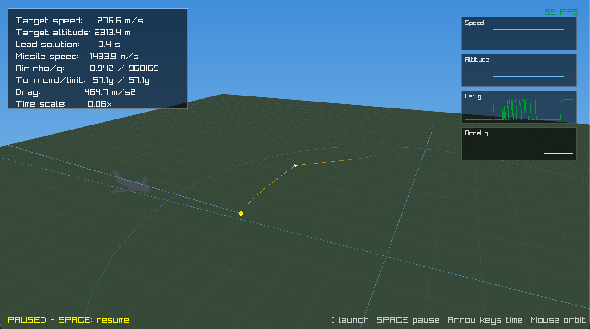
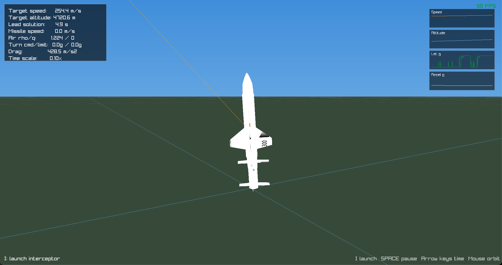

# Ground-to-Air Missile Intercept Sim

A C and raylib missile test sandbox. The sim loads the included `model/AVMT300.obj`
missile model, spawns an aircraft on a new orbit after each hit, computes a lead
solution, and guides the interceptor toward the real moving target.

The interceptor uses a simple atmosphere model: density falls with altitude,
drag is based on dynamic pressure, and steering is limited by available
aerodynamic/boost authority. The HUD includes live speed, altitude, and lateral
g charts.

The sim loads `model/uploads_files_2943574_MIG_airplane_lowpoly.stl` for the
aircraft target. If that file is missing, it falls back to `model/plane.obj`,
then to the built-in low-poly procedural plane.

## Preview







## Build

```sh
make
```

## Run

```sh
make run
```

## Controls

- `I`: launch interceptor
- `Space`: pause or resume
- `Left / Right`: halve or double time scale
- `Down`: set time scale to `0.10x`
- `Up`: reset time scale to `1.00x`
- Double-click window: toggle borderless fit-to-screen
- Mouse drag: orbit camera around the missile
- Mouse wheel: zoom camera
